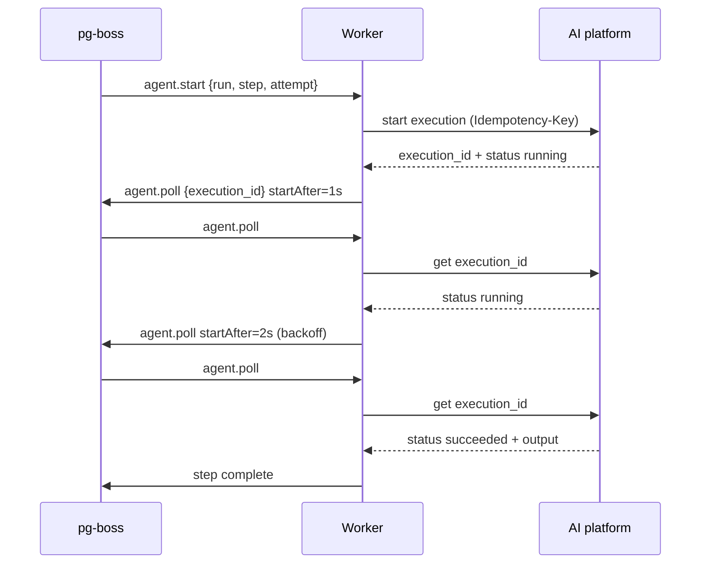

# Agent Execution Worker — Implementation Specification

| | |
|---|---|
| **Version** | 1.0-draft |
| **Status** | Draft |
| **Date** | 2026-09-16 |
| **Scope** | How a queue-backed workflow engine runs an AI agent execution to completion |
| **Companion** | `soar-agent-platform-requirements.md` (what the platform must expose), `../../api/openapi.yaml` (the platform contract) |

---

## 1. Introduction

### 1.1 Purpose

This document specifies the **caller side** of an AI agent integration: the worker that starts an
agent execution, keeps track of it, and reports its outcome to the workflow that asked for it.

The platform never blocks. Starting an execution returns an execution id with a status immediately,
whether or not the agent has finished, and a status query answers with the current state at once. The
worker therefore starts the execution, stores its id on a queued job, and polls until the execution
reaches a terminal state or a configured deadline expires.

It is written for an engine that uses **pg-boss** (a Postgres-backed job queue) and describes the job
shapes and scheduling rules in those terms. Nothing else about the engine is assumed.

### 1.2 Scope

**In scope**

- The job model: which jobs exist, what they carry, and how they schedule each other.
- Starting an execution safely, including across worker crashes and job redelivery.
- Polling cadence, exponential backoff, and jitter.
- Deadlines, cancellation, and the mapping from platform outcomes to step outcomes.
- Configuration, observability, and acceptance scenarios.

**Out of scope**

- The workflow engine's own data model, scheduling, and UI.
- How a step's inputs are resolved, or how its outputs are consumed downstream.
- The platform's internals. Section 3 states only what the worker depends on.

### 1.3 Conventions

| Level | Meaning |
|---|---|
| **MUST** | The integration is incorrect without it. |
| **SHOULD** | Strongly preferred. Departing from it needs a recorded reason. |
| **MAY** | Optional. |

Requirements carry stable identifiers of the form `WRK-NN`. Each states its behaviour and how to tell
it was implemented.

### 1.4 Terminology

| Term | Meaning |
|---|---|
| **Step** | One agent invocation inside a workflow run, identified by `run_id` + `step_id`. |
| **Attempt** | One try at a step. A new attempt is created *above* the worker and starts a new execution; the worker never creates one. |
| **Execution** | The platform's record of one agent run, identified by an `execution_id`. |
| **Terminal** | An execution in `succeeded`, `failed`, or `cancelled`. It will not change again. |
| **Deadline** | The wall-clock time after which the worker stops waiting for a step's execution. |
| **Poll tick** (or just *tick*) | One `agent.poll` job: one turn of the polling loop — a single status query plus the decision of what to do next. |
| **Queue** | A named lane of jobs stored in Postgres by pg-boss. The name is an arbitrary string chosen by this spec, not a library concept. |
| **Job** | One unit of work on a queue, carrying a JSON payload. |
| **Handler** | The function a worker registers for a queue. Resolving completes the job; throwing fails it. |

---

## 2. Design rules

Two rules constrain everything below. They are stated once here and enforced throughout.

**R1 — One execution per attempt.** Once the worker holds an execution id for an attempt, no code
path may start another execution for that attempt: not a retryable failure, not a failed cancel, not
a redelivered job, not an expired deadline. Re-running an agent costs a second model call and can
produce a second set of side effects.

**R2 — A crash must never produce a second run.** Every start call carries an idempotency key derived
from the attempt, so a redelivered job re-sends the same key and the platform replays the recorded
execution instead of starting a new one.

---

## 3. What the worker requires of the platform (WRK-01 … WRK-07)

These are dependencies, not designs. `../../api/openapi.yaml` is a contract that satisfies all of
them; a platform that does not yet satisfy one is a blocker, noted per requirement.

### WRK-01 · Non-blocking start · MUST

Starting an execution returns immediately with an `execution_id` and a status, whether or not the
agent has finished. A platform that only returns a result when the agent completes cannot be driven
by this worker.

### WRK-02 · Status by execution id · MUST

Querying an execution by id returns its current state immediately, including a terminal result once
it exists. This is the polling primitive; without it there is nothing to poll.

### WRK-03 · Idempotent start · MUST

A start request carries a caller-supplied idempotency key. Re-sending the same key with the same body
starts nothing and returns the recorded execution, with its original id. This is what makes R2 hold.

### WRK-04 · Idempotency retention outlives queued jobs · MUST

Recorded keys are retained longer than the longest time a job can sit in the queue before delivery.
The reference contract retains them for at least 24 hours; the engine's job retention MUST be
configured below that figure.

### WRK-05 · Cancellation by execution id · MUST

An execution can be cancelled by id, and cancellation is idempotent. Cancelling a terminal execution
is not an error.

### WRK-06 · Explicit retryability on errors · SHOULD

Every error carries a flag saying whether retrying can succeed, so the worker classifies outcomes
without a code table of its own. Rejections that ask the caller to wait carry a `Retry-After` header.

### WRK-07 · Rate-limit signalling · SHOULD

Responses carry rate-limit headers, so a fleet of pollers can slow itself down before it is throttled.

**Execution shape.** The worker reads only `execution_id`, `status` (`queued`, `running`,
`succeeded`, `failed`, `cancelled`), `output` or `error`, and `trace_id`. It MUST NOT depend on
usage, model, latency, or timestamp fields, which the contract does not carry.

---

## 4. Job model (WRK-10 … WRK-15)

### 4.0 pg-boss in one page

`agent.start` and `agent.poll` are **queue names this spec chose**, not pg-boss concepts. In pg-boss a
queue is a named lane of jobs stored in Postgres tables, and its name is an arbitrary string; the dot
is a grouping convention only, the way one might name `email.send`.

Three calls carry the whole model:

```js
await boss.createQueue('agent.start')                    // declare the queue once, at startup
await boss.send('agent.start', payload, options)         // producer: enqueue a job
await boss.work('agent.start', async ([job]) => { ... }) // consumer: handle jobs
```

A handler that resolves completes its job. A handler that throws fails it, and pg-boss retries it
under the queue's retry policy — which is exactly why WRK-12 forbids throwing to mean "still running".

The options this spec depends on:

| Option | Semantics | Used for |
|---|---|---|
| `startAfter` | Delays the job by N seconds, or until a timestamp | The gap between poll ticks, held in Postgres rather than in a sleeping worker |
| `singletonKey` | Only one job with that key may be in the created, retry, or active state at a time | Set to `execution_id`, so one execution can never have two poll chains (WRK-13) |
| `retryLimit`, `retryDelay`, `retryBackoff` | The queue's retry policy for failed jobs | *Call* failures only — never "still running" (WRK-12) |

### WRK-10 · Two job types · MUST

| Queue | Purpose | Payload |
|---|---|---|
| `agent.start` | Start one execution for one attempt | `run_id`, `step_id`, `attempt`, `agent_id`, `agent_version`, `input`, `timeout_ms`, `deadline_at` |
| `agent.poll` | One status check for one execution | `execution_id`, `run_id`, `step_id`, `attempt`, `deadline_at`, `poll_count` |

`deadline_at` is an absolute timestamp, computed once (WRK-40) and copied onto every poll job.

### WRK-11 · One poll job per tick · MUST

A poll job performs exactly one status query, then completes. If the execution is still running, the
job enqueues the next poll with `startAfter` set to the backoff delay. The worker MUST NOT sleep
inside a job while waiting for an agent. Two reasons, both concrete:

- **Capacity.** A sleeping handler occupies its worker for the whole agent run, and pg-boss defaults
  to one worker per queue per process (`localConcurrency` 1, `batchSize` 1). Fifty executions in
  flight would need fifty idle slots. Ticking decouples how many executions the worker can babysit
  from how long the agents take, because each tick is a millisecond-scale read.
- **Restarts.** A sleeping handler's timer lives in process memory and dies with a deploy or a crash,
  while its job stays `active` until `expireInSeconds` lapses (WRK-15). A queued tick is a durable row
  with a due time: a restart loses nothing, and whichever worker is alive when it falls due picks it
  up.

### WRK-12 · "Still running" is not a job failure · MUST

A poll that finds the execution still running is a **successful** job. The worker MUST NOT signal it
by throwing, and MUST NOT rely on the queue's retry mechanism to schedule the next poll. Conflating
the two makes every long execution look like a failing job, poisons failure metrics, and eventually
dead-letters healthy work.

Job retries (`retryLimit`, `retryDelay`) are reserved for *call* failures: the platform was
unreachable, or answered 5xx or 429.

### WRK-13 · One poller per execution · MUST

Poll jobs are enqueued with `singletonKey` set to the `execution_id`, so a redelivered or duplicated
job cannot produce two poll chains for one execution. Two chains are not dangerous — polling is a
read — but they double the request rate and race to complete the step.

This relies on pg-boss's documented `singletonKey` semantics: jobs sharing a key allow only one in the
created, retry, or active state at a time. A second enqueue for the same execution is therefore
discarded rather than queued.

### WRK-14 · Declare both queues at startup · MUST

The worker calls `createQueue` for `agent.start` and `agent.poll` before it sends anything. pg-boss
v10 and later do not create a queue implicitly on `send`, so a worker that skips this fails on its
first enqueue. On majors before v10 the call is harmless, so it is safe to make unconditionally.

### WRK-15 · Bound how long a tick may stay active · SHOULD

Set `expireInSeconds` per queue rather than inheriting the default. A job that has been claimed but
never completed — its worker died mid-tick — stays `active` until that window lapses, and the default
is 15 minutes. A poll tick is a millisecond-scale read, so a minute is already generous; a start job,
which makes one platform call, can afford a little more. Left at the default, a crash mid-tick stalls
that step for a quarter of an hour before anything retries it.



---

## 5. Starting an execution (WRK-20 … WRK-24)

### WRK-20 · Stable idempotency key · MUST

The key is a pure function of the attempt: `key = f(run_id, step_id, attempt)`, for example a hash of
the three joined by a separator that cannot occur in any of them. It MUST NOT include a timestamp,
a random value, or a retry counter, since a redelivered job has to reproduce it exactly.

A new attempt produces a new key, which is the only mechanism by which a step runs an agent twice.

### WRK-21 · Send the key on every start call · MUST

Including retries of the call itself. Sending it only on the first try defeats WRK-03.

### WRK-22 · Handle both start outcomes · MUST

- **Terminal already** (the platform finished within the request, or this is a replay of a finished
  execution): record the outcome and complete the step. No poll job.
- **Not terminal**: record the `execution_id` against the step, then enqueue the first poll with
  `startAfter` set to the initial delay.

### WRK-23 · Retry call failures, bounded · SHOULD

A transport failure, 5xx, or 429 on the start call is retried with the same key, up to a configured
limit, with the same backoff curve as polling. Because the key is stable, a retry that follows a
request the platform *did* process returns the existing execution rather than creating a second one.

A rejection that is not retryable — invalid input, unknown or disabled agent version, a key reused
with a different body — fails the step immediately and MUST NOT be retried.

### WRK-24 · Deadline starts at the first send · MUST

`deadline_at = now + timeout_ms + margin`, computed before the first start call and then never
recomputed. The margin covers one poll interval, so a step is not failed for a result that had
already arrived. Recomputing on redelivery would let a crash-looping job extend its own deadline
indefinitely.

---

## 6. Polling (WRK-30 … WRK-33)

### WRK-30 · One query, one decision · MUST

Each tick queries the execution by id and then does exactly one of:

| State | Action |
|---|---|
| Terminal | Write the outcome (section 8), complete the step, enqueue no further poll. |
| Not terminal, deadline not passed | Enqueue the next poll with `startAfter = backoff(poll_count)`. |
| Not terminal, deadline passed | Run the timeout path (WRK-41). |

### WRK-31 · Never start from a poll job · MUST

A poll job has no code path that starts an execution. This is R1 expressed in the one place it is
most tempting to violate: a poll that finds a retryable failure MUST report it, not restart it.

### WRK-32 · Call failures do not end the step · SHOULD

If the status query itself fails (transport, 5xx, 429), the execution is still running on the
platform and the step is still live. The worker retries the query — either by letting the job fail
into the queue's retry, or by enqueuing the next tick — up to the deadline. Only the deadline ends a
step whose platform state is unknown.

An execution id that is reported as not found is different: the record is gone, so the step fails
immediately (section 8) rather than polling a ghost until the deadline.

### WRK-33 · Carry the poll count · SHOULD

`poll_count` increments on each tick and drives the backoff curve. Keeping it in the payload means
the curve survives redelivery without a database read.

---

## 7. Backoff (WRK-40 … WRK-42)

### WRK-40 · Exponential with a cap · MUST

`delay = min(max_delay, base × factor^poll_count)`.

Defaults: `base = 1s`, `factor = 2`, `max_delay = 30s`. Fast agents finish within the first couple of
ticks; slow ones settle into a cheap steady rate instead of hammering the platform for minutes.

These delays are a **floor, not an exact time**. Workers discover due jobs by polling, so the real gap
is `startAfter` plus up to `pollingIntervalSeconds` (default 2). A 1-second backoff lands in roughly
one to three seconds, and an interval below a second buys nothing. Treat the figures here as nominal.

### WRK-41 · Full jitter · MUST

The scheduled delay is `random(0, delay)`, not `delay`. Jitter is required, not a refinement: a batch
of steps started together — the normal case when a workflow fans out — otherwise polls in lockstep
forever, turning a smooth load into periodic spikes that trip the platform's rate limits.

### WRK-42 · Honour `Retry-After` · SHOULD

When a response carries `Retry-After` (a 429 or 503) and it exceeds the computed delay, the longer
value wins. The platform's own signal outranks the local curve. The same applies to rate-limit
headers that show the window nearly exhausted.

---

## 8. Deadlines, cancellation, and outcomes (WRK-50 … WRK-53)

### WRK-50 · Cancel, then fail · MUST

When the deadline passes with the execution still running, the worker cancels the execution and then
fails the step with a timeout error. Cancelling first stops the agent spending on a result nobody is
waiting for.

### WRK-51 · Cancel is best-effort · MUST

A cancel that fails MUST NOT mask the timeout: the step still fails with the timeout error, and the
cancel failure is logged. Cancel MAY be retried a small number of times, and a cancelled execution
MAY still report `running` briefly, which is not an error and MUST NOT be polled further.

### WRK-52 · Outcome mapping · MUST

| Platform state | Step outcome | Start a new execution? |
|---|---|---|
| `succeeded` | Succeeded, with `output` | **No** |
| `failed`, retryable | Failed, marked retryable for the layer above | **No** |
| `failed`, not retryable | Failed, terminal | **No** |
| `cancelled` | Cancelled — not a failure, and not routed to error handling | **No** |
| Still running at the deadline | Timed out, after cancel | **No** |
| Execution id not found | Failed, terminal ("execution record lost") | **No** |
| Status query failed | No outcome yet; retry until the deadline | **No** |

The final column is R1. A retryable failure is *reported*, so the layer that owns attempts can decide
to create attempt *n+1* — which produces a new idempotency key and, only then, a new execution.

### WRK-53 · Record the result once · MUST

Writing a step's outcome is idempotent and keyed by `run_id` + `step_id` + `attempt`: a duplicated
final poll MUST NOT produce two results or two completion events.

---

## 9. Crash recovery (WRK-60 … WRK-62)

### WRK-60 · Redelivery is normal · MUST

The queue may deliver any job more than once. Each job type is safe under redelivery:

| Crash point | On redelivery | Why it is safe |
|---|---|---|
| Before the start call is sent | The call is sent for the first time | Nothing happened yet |
| After the platform created the execution, before the worker recorded the id | Same key is re-sent; the platform replays and returns the same id | WRK-03, WRK-20 |
| After the id was recorded, before the first poll was enqueued | The start job re-sends the key, gets the same execution, and enqueues the poll | Replay is free of side effects |
| Mid-poll-chain | At most one tick is lost; the redelivered tick queries again | Polling is a read |
| After the terminal result was read, before the step was completed | The step is completed from a repeated query | WRK-53 |

### WRK-61 · No hand-off gap · MUST

The worker MUST NOT treat "I have no execution id recorded" as "no execution exists". That inference
is what creates duplicate runs. The only safe recovery is to re-send the key and let the platform
answer.

### WRK-62 · Bound the orphan window · SHOULD

If job retention exceeds the platform's idempotency retention (WRK-04), a very old redelivered job
can no longer replay and would start a second execution. The worker SHOULD refuse to start an
execution for a job whose `deadline_at` has already passed, which discards such jobs instead.

---

## 10. Configuration

| Key | Default | Meaning |
|---|---|---|
| `poll.base_delay` | 1s | First poll delay |
| `poll.factor` | 2 | Exponential factor |
| `poll.max_delay` | 30s | Cap on the poll interval |
| `poll.jitter` | full | `random(0, delay)` |
| `step.timeout` | per step, e.g. 120s | Drives `timeout_ms` and `deadline_at` |
| `step.deadline_margin` | 1 × `poll.max_delay` | Grace so a just-arrived result is not discarded |
| `start.call_retries` | 5 | Bounded retries of the start call, same key |
| `poll.call_retries` | 3 | Retries of one status query before the tick is rescheduled |
| `cancel.attempts` | 3 | Best-effort cancel tries |
| `expireInSeconds` (poll) | 60s | How long a claimed tick may stay `active` before pg-boss reclaims it. The library default of 15 minutes is far too long for a millisecond read. |
| `expireInSeconds` (start) | 120s | The same, for a start job, which makes one platform call |
| `pollingIntervalSeconds` | 2 | How often workers look for due jobs. Adds up to this much to every scheduled delay. |
| `localConcurrency` | tune | Workers per queue per process, default 1. Size it for concurrent ticks, not concurrent executions. |
| `queues` | `agent.start`, `agent.poll` | Queue names |

Timeouts are per step, because an interactive triage path and an overnight enrichment tolerate very
different waits. The platform enforces its own limit, so `step.timeout` MUST NOT exceed the agent
version's maximum.

---

## 11. Observability (WRK-70 … WRK-71)

### WRK-70 · Store the correlation id · MUST

`trace_id` is stored with the step result, so an engineer can open the platform's trace for a failed
step instead of searching by timestamp. It is the only correlation the execution carries.

### WRK-71 · Metrics worth having · SHOULD

Polls per execution, time from start to terminal, timeouts, cancels, replayed starts (a rising count
means crash-looping), and duplicate poll suppressions. Polls per execution is the one that shows
whether the backoff curve is tuned: a median in the low single digits with a long tail is healthy.

---

## 12. Acceptance scenarios

An implementation is complete when each of these passes against a platform implementing section 3 —
the mock server in this repo (`cmd/mockplatform`) is enough for all of them.

| # | Scenario | Expected |
|---|---|---|
| 1 | Agent finishes instantly | Step succeeds from the start call; no poll job is enqueued |
| 2 | Agent takes several seconds | Start returns running, N polls follow with increasing gaps, step succeeds |
| 3 | Execution fails, retryable | Step is failed and marked retryable; **exactly one** execution exists |
| 4 | Execution fails, not retryable | Step is failed terminally; no retry, no second execution |
| 5 | Deadline expires mid-run | Cancel is sent, step fails with a timeout error |
| 6 | Cancel itself fails | Step still fails with the timeout error; cancel failure only logged |
| 7 | Crash after send, before id recorded | Redelivery replays the key; exactly one execution exists |
| 8 | Duplicate poll job for one execution | Second is suppressed by `singletonKey`; one completion event |
| 9 | Status query fails transiently | Query is retried; step still completes normally |
| 10 | Platform returns 429 with `Retry-After` | Next poll waits at least that long |
| 11 | Execution id not found | Step fails terminally rather than polling to the deadline |
| 12 | Job redelivered after its deadline | Job is discarded; no execution is started (WRK-62) |

Scenario 3 and scenario 7 are the two that matter most: together they prove R1 and R2. Both SHOULD
assert on the platform's execution count, not only on the step outcome.

---

## 13. Open questions

1. **Lookup by idempotency key.** The contract has no "find the execution for this key" operation, so
   recovery depends entirely on replay (WRK-03). An explicit lookup would let a worker reconcile
   orphans it never recorded — worth requesting if the platform can offer it.
2. **Actual retention window.** WRK-04 assumes at least 24 hours. The engine's job retention must be
   configured against the real figure.
3. **Partial output.** The contract carries no progress or partial output, so a long-running agent
   shows only `running` to an operator. If progress becomes a product requirement, it needs a
   platform-side field and a poll that stores it.
4. **Fan-out.** A workflow step that maps an agent over many items currently means one execution and
   one poll chain per item. A batch start would cut the request volume considerably.
